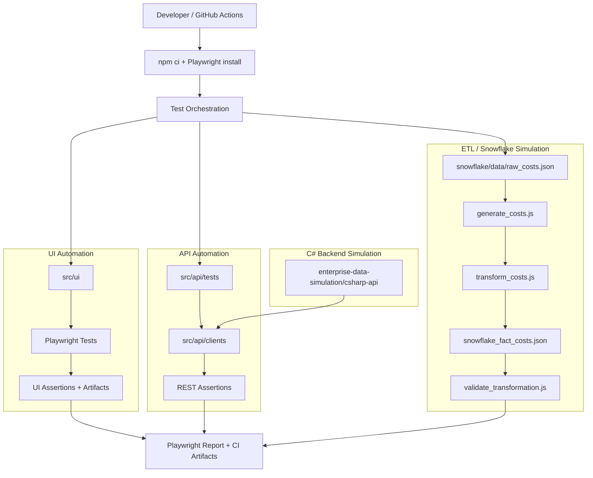

## 🧰 Tech Stack

## 🗺️ Automation Architecture Overview (UI • API • ETL)

## 🧩 Enterprise Data Simulation (Snowflake-Style ETL)

This framework is split into **UI**, **API**, and **ETL/Data** layers to mirror real enterprise testing.

### 📌 Responsibility Map (What runs where)

```text
┌──────────────────────────────────────────────────────────┐
│                  Test Orchestrator                       │
│          (Local Run or GitHub Actions CI)                 │
└──────────────────────────────────────────────────────────┘
            │
            ▼
┌──────────────────────────────────────────────────────────┐
│ UI Automation Layer                                      │
│ src/ui/                                                  │
│ • Playwright UI tests (POM)                              │
│ • User flows, navigation, regressions                    │
└──────────────────────────────────────────────────────────┘
            │
            ▼
┌──────────────────────────────────────────────────────────┐
│ API Automation Layer                                     │
│ src/api/tests/                                           │
│ • REST API tests (GET/POST/PATCH/DELETE)                 │
│ • Status codes, payloads, payload validation             │
└──────────────────────────────────────────────────────────┘
            │
            ▼
┌──────────────────────────────────────────────────────────┐
│ ETL / Snowflake-Style Data Simulation                    │
│ enterprise-data-simulation/snowflake/                    │
│ • Raw data generation                                    │
│ • Transform logic (fact outputs)                         │
│ • Data reconciliation + quality checks                   │
└──────────────────────────────────────────────────────────┘
            │
            ▼
┌──────────────────────────────────────────────────────────┐
│ Reports & CI Artifacts                                   │
│ • Playwright HTML report                                 │
│ • Logs, traces, screenshots                              │
└──────────────────────────────────────────────────────────┘
```
### 🔁 Execution Flow (Visual)



```md

This repository includes a **deterministic, CI-safe simulation of a Snowflake ETL pipeline**.

It demonstrates how an SDET validates **data correctness and performance**, not just UI or API responses.
```

###  Folder Structure

```text
enterprise-data-simulation/
└─ snowflake/
   ├─ data/
   │  ├─ raw_costs.json
   │  └─ snowflake_fact_costs.json
   ├─ scripts/
   │  ├─ generate_costs.js
   │  ├─ transform_costs.js
   │  └─ validate_transformation.js
   ├─ perf/
   │  └─ baseline.json
   └─ README.md
```

```text
.github/workflows/etl-validate.yml
```
###  What the ETL Workflow Does

1. Generate representative raw data (5,000 rows)
2. Transform raw → fact output (GROUP BY + SUM)
3. Independently re-aggregate raw data
4. Compare expected vs actual results
5. Measure execution runtime
6. Fail CI if:
   - Data mismatches are detected
   - Runtime regression exceeds allowed threshold

---

##  Runtime Regression Protection

In addition to validating data correctness, the ETL pipeline also protects
against **performance regressions**.

### How Runtime Is Evaluated

- ETL execution time is measured during CI
- A historical baseline is used when available
- Safe defaults are applied when no baseline exists

```text
enterprise-data-simulation/snowflake/perf/baseline.json
```

### Why CI Uses 5,000 Rows (and Not Millions)

HealthMonix-style pipelines can process **millions of rows**, but CI must stay fast.

This repo intentionally uses **5,000 representative rows** in PR builds to:
- Catch ETL logic regressions quickly (GROUP BY / SUM rules)
- Keep pull request pipelines fast and reliable
- Prevent deployments from slowing down due to validation suites

### How This Scales to Millions

The same scripts work for larger datasets by changing an environment variable:

- PR / CI: `ROWS=5000` (fast correctness + quick runtime signal)
- Nightly / scheduled: `ROWS=100000+` (heavier performance validation)

This is the same strategy enterprise teams use:
**fast correctness checks per commit + scheduled performance gates**

---

##  Run ETL Locally

### 1) Install dependencies
```bash
npm ci
```
```bash
npm run etl:generate
npm run etl:transform
npm run etl:validate
```
```bash
ROWS=10000 npm run etl:generate
npm run etl:transform
npm run etl:validate
```
#### macOS / Linux
```bash
ROWS=10000 npm run etl:generate
npm run etl:transform
npm run etl:validate
```

#### Windows
```powershell
$env:ROWS="10000"
npm run etl:generate
npm run etl:transform
npm run etl:validate
```

---

## ▶️ Run UI + API Locally (Playwright)

### 1) Install dependencies
```bash
npm ci
npx playwright install
```
```bash
npm test
```
```bash
npx playwright test src/ui
```
```bash
npx playwright test src/api/tests
```
```bash
npx playwright test src/ui --headed
```
```bash
npx playwright show-report
```
## ▶️ Run Legacy UI (Selenium)

### Run Selenium example tests
```bash
npm run test:selenium
```

## ▶️ Run Local C# COST API (Optional Integration)

```bash
cd enterprise-data-simulation/csharp-api
dotnet restore
dotnet run
```

